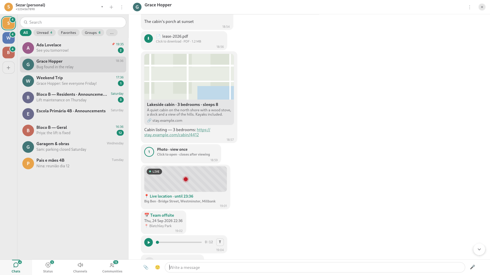
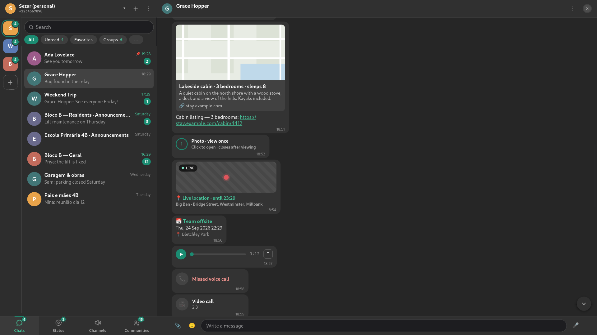

# chatot

A native WhatsApp client for the Linux desktop, built with GTK4 and
libadwaita on top of [whatsmeow](https://github.com/tulir/whatsmeow). It
links to your phone as a companion device, the way WhatsApp Web does, and
keeps your chats, groups, communities, channels and status updates in one
window.

Chatot is unofficial. It is not affiliated with, endorsed by or supported
by WhatsApp or Meta, and using an unofficial client may be against
WhatsApp's terms of service. It is in beta.



## What it does

- **Messaging**: text, replies, reactions, forwards, edits, delete for
  everyone, mentions, polls, contact cards and business quick replies.
- **Media**: photos, videos, albums, documents, stickers and GIFs, with an
  in-app viewer, previews for media that is not downloaded yet and
  on-demand download.
- **Voice notes**: record, play at 1x/1.5x/2x, and transcribe locally with
  whisper.cpp.
- **Locations**: send a place from an inline map, share a live location and
  follow someone else's.
- **Groups, communities, channels and status**: create and manage groups,
  browse communities and channels, view and post status updates.
- **Organisation**: full-text search, starred messages, pins, archive,
  mutes, labels, disappearing messages, clear or delete chats and blocked
  contacts.
- **Profile**: change your name, About line, profile picture and badge
  colour from the app.
- **Several accounts** in one window, each with its own badge.
- **Desktop integration**: notifications with sound, a tray item with the
  unread count, light and dark styles, chat wallpapers and shell theming.



## Install

Every release on the [releases page](https://github.com/sezaru/chatot/releases)
ships a Flatpak bundle and an AppImage for x86_64 and aarch64.

**Flatpak bundle** (needs the GNOME 50 runtime, which `flatpak install`
fetches from your configured remote if it is missing):

```sh
flatpak install --user chatot-x86_64.flatpak
flatpak run com.sezdm.chatot
```

**AppImage**:

```sh
chmod +x chatot-x86_64.AppImage
./chatot-x86_64.AppImage
```

The AppImage bundles its own Mesa, so outside NixOS it may fall back to
software rendering.

**Nix**: the flake builds chatot as a desktop app with everything it needs
(GStreamer plugins, pixbuf loaders, ffmpeg, poppler, whisper.cpp, fonts)
and installs the launcher and icons.

```sh
nix run github:sezaru/chatot
nix profile install github:sezaru/chatot
```

On NixOS or Home Manager, add the flake as an input and put
`chatot.packages.${system}.chatot` in your package list.

## Building from source

`direnv allow` (or `nix develop`) enters the devenv shell with the cgo GTK
stack, Go and the tooling. `go run ./cmd/chatot` starts the app against
your real account; `CHATOT_FAKE=1 go run ./cmd/chatot` runs it on canned
data. The Flatpak manifest lives in `build-aux/flatpak/`.

## License

GPL-3.0-or-later. See `LICENSE`.
